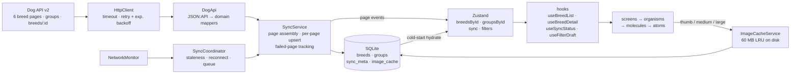
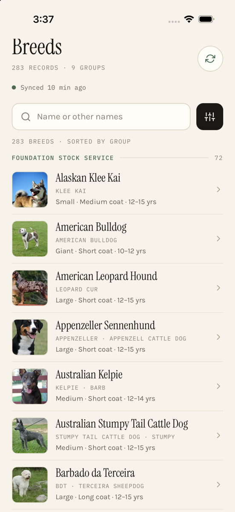
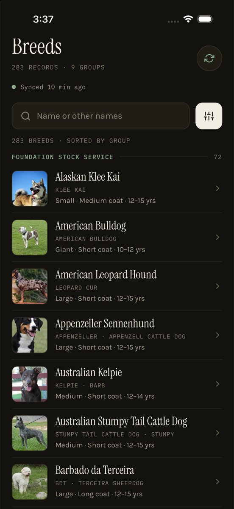
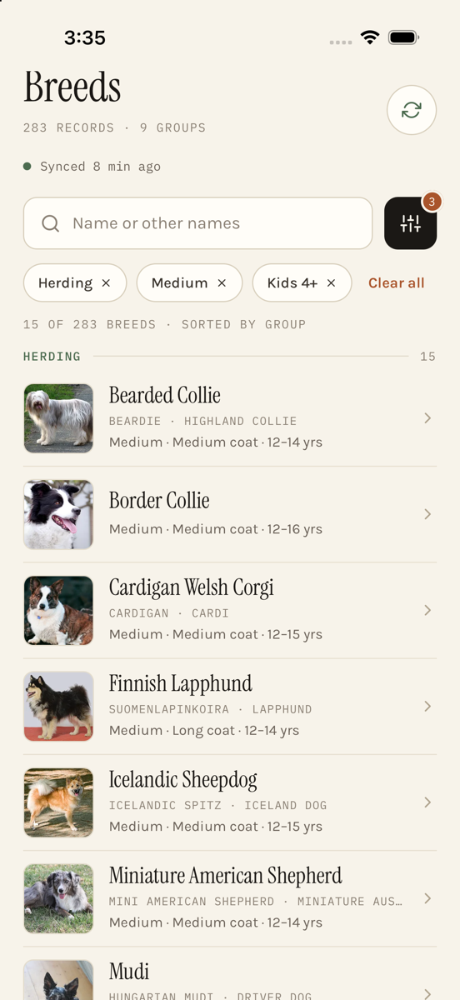
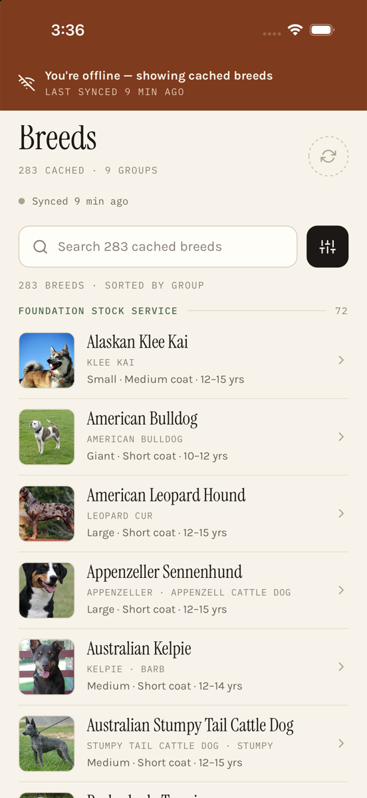
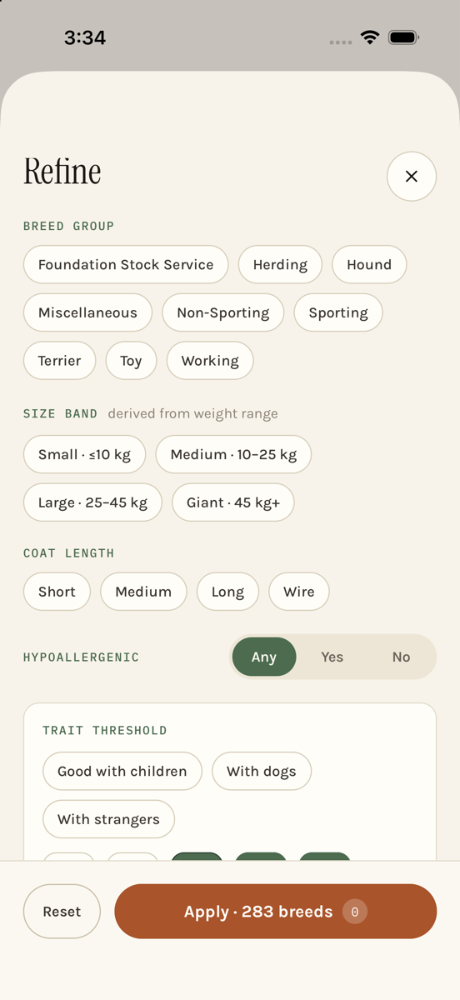
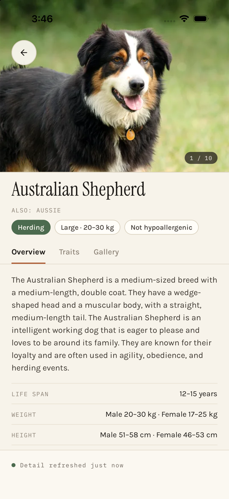
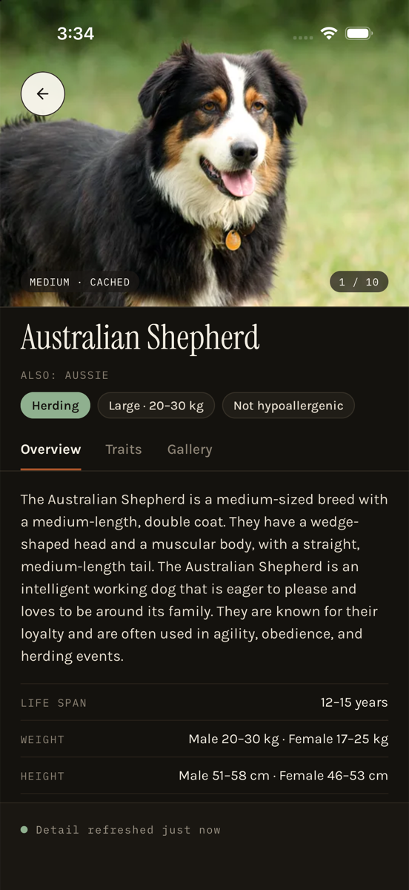
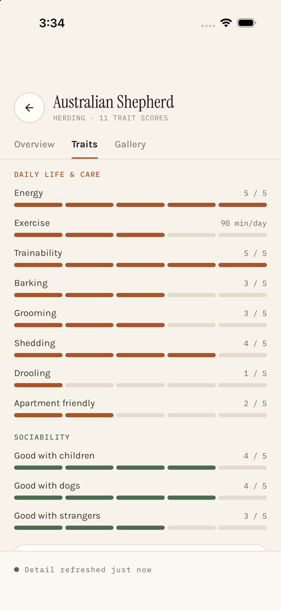
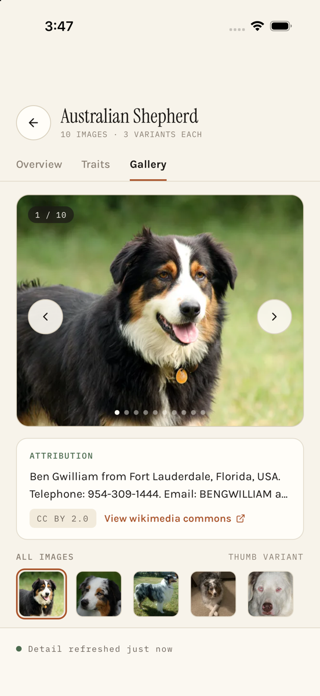

# Dog Breed Explorer

Offline-first breed explorer for the [Dog API v2](https://dogapi.dog/docs/api-v2): 283 breeds,
9 groups, debounced search, multi-facet filters, and a full detail view with traits and an
attributed photo gallery. It keeps working with no network after the first sync.

Expo SDK 57 · React Native 0.86 · TypeScript (strict, no `any`) · expo-router · expo-sqlite ·
Zustand · FlashList v2.

## Demo

93-second walkthrough on the iPhone 17 simulator (iOS).

<video src="docs/recordings/demo.mp4" width="320" controls muted playsinline></video>

If the player doesn't load, [open the MP4](docs/recordings/demo.mp4) (4.3 MB).

## Quick start

```bash
npm install
cp .env.example .env
npm run ios      # or: npm run android
```

The app runs in **Expo Go**, so no native build is needed. Metro opens the simulator and installs
Expo Go automatically. Requirements: Node 20+ and Xcode (iOS) or Android Studio (Android) with a
simulator or emulator.

```bash
npm test             # 73 tests / 11 suites
npm run typecheck    # tsc --noEmit, strict
npm run lint         # eslint-config-expo, no-explicit-any = error
npm run bundle:analyze
```

## Architecture overview

On the device, SQLite is the source of truth. At launch the app opens the database, loads every
cached breed and group into a normalised Zustand store, and renders the list straight away. It
only goes to the network afterwards, and only when the cache is more than an hour old, is
incomplete, or the user asks for a refresh. A `SyncService` builds the dataset from the six
paginated API pages. It fetches page 1 first to learn how many pages exist, then fetches the rest
three at a time. Each page is written in its own transaction and pushed into the store as soon as
it arrives, so rows appear progressively. Pages that fail are recorded one by one. The list keeps
showing the data it has, and a card offers to retry just those pages.

A `SyncCoordinator` owns the timing rules: the freshness window, syncing when the app returns to
the foreground, syncing on reconnect, and queuing a manual sync requested while offline. On the
detail screen, `GET /breeds/:id` refreshes that one breed in the background. Images go through
`ImageCacheService`, a disk cache capped at 60 MB that deletes the least recently used files
first. The list loads only the first `thumb`. The swipeable detail header loads `medium` and
the gallery loads `large`, each only for the visible slide and its immediate neighbours.

The UI follows atomic design (`atoms → molecules → organisms → templates`). Each screen is thin:
it calls hooks (`useBreedList`, `useBreedDetail`, `useFilterDraft`, `useSyncStatus`), which hold
all the logic, and passes plain props to components. Repositories, the API client, the network
monitor and the image cache are interfaces wired up in one place (`createServices`). No
component imports `expo-sqlite`, `fetch` or NetInfo, and tests substitute fakes.



**Data flow (API → Cache → UI):** Dog API → `HttpClient` (retries) → `DogApi` (parse and map to
domain types) → `SyncService` → **SQLite** → Zustand store → hooks → components. The store is
written only from SQLite at launch or from sync events, so the UI and the database cannot drift
apart.

More detail, including the schema and the image-variant policy, is in
[docs/ARCHITECTURE.md](docs/ARCHITECTURE.md).

## Key technical decisions: answers to the assignment questions

Each question the brief asks is answered below. Longer rationale and the alternatives
considered are in [docs/DECISIONS.md](docs/DECISIONS.md).

### State management: which one, and why?

**Zustand.** It is used as a normalised cache: `breedsById` / `breedIds` and
`groupsById` / `groupIds`, plus small `sync` and `filters` stores.

- **Selector subscriptions:** each component subscribes only to the slice it reads. When a sync
  merges page 4, rows from pages 1–3 keep their object identity and don't re-render. For a
  283-row list with heavy rows, this is the property that matters most.
- **Works outside React:** the sync service's event stream writes straight into the store
  without going through a component.
- **Alternatives rejected:**
  - *Redux Toolkit* adds actions, slices and middleware for a single entity graph and gives no
    benefit here.
  - *Context + reducer* re-renders every consumer on every change, which is the wrong behaviour
    for a virtualised list.
  - *Jotai* would work, but atom-per-entity is awkward when whole 48-breed pages arrive at once.

### Database: which one, and why?

**expo-sqlite.**

- **Writes:** it can write one page of 48 breeds per transaction as pages arrive, and it keeps
  an image-cache table indexed by last access for LRU eviction. Both are natural in SQL.
- **Why not AsyncStorage:** it stores a single string per key, so the whole ~1.5 MB dataset
  would be rewritten on every page merge. It also has a soft per-item size limit on Android.
- **Why not WatermelonDB:** it's built for large relational datasets, and it needs a native
  build. expo-sqlite runs in Expo Go, so `npm run ios` works first time.

**Schema design:** indexed columns for every field the filters use, plus the full breed record
stored as JSON.

```sql
breeds      (id PK, name, group_id, size_band, coat_length, hypoallergenic,
             good_with_children, good_with_dogs, good_with_strangers,
             search_text, payload JSON, page_number, updated_at)
             -- indexes: group_id, name
groups      (id PK, name, label, breed_ids JSON, updated_at)
sync_meta   (key PK, value JSON)   -- lastSyncedAt, lastAttemptAt, totalPages, failedPages[], totalRecords
image_cache (url PK, local_uri, variant, bytes, last_access)   -- index: last_access
```

A breed is always read whole. Splitting it into `breed_images`, `breed_traits`,
`breed_other_names` and so on would cost five or six joins to rebuild a row for queries the app
never runs. The indexed columns mean filtering can move into SQL if the dataset ever grows by an
order of magnitude. Migrations are versioned with `PRAGMA user_version`.

### Offline sync strategy: how does it work?

1. **Cache first on every launch.** The app reads SQLite into the store and renders the list
   before making any network call. With a warm cache, time to interactive doesn't depend on
   the network at all.
2. **When it syncs:**
   - on first launch
   - when data is more than 60 minutes old
   - when the previous sync left failed pages
   - when the app returns to the foreground
   - when the network comes back
   - when the user pulls to refresh or taps sync
3. **How it syncs:** fetch page 1 to learn the page count (`meta.pagination.last`), then fetch
   the other pages three at a time. Each page is upserted in its own transaction and pushed into
   the store as soon as it arrives. Groups are fetched separately and never block breeds.
4. **Retries:** 4 attempts, 400 ms base delay doubling each time, capped at 6 s, with jitter.
   5xx, 408, 429 and network errors retry; other 4xx errors fail immediately.
5. **Partial failure:** failed pages are stored in `sync_meta.failedPages`. Cached data stays on
   screen, a banner names the failed pages, and *Retry* refetches only those pages.
6. **Offline:** a persistent banner shows "Last synced …". Search, filters and detail screens
   keep working from SQLite. A sync requested while offline is queued and runs automatically on
   reconnect.
7. **Showing freshness:** a green dot plus "Synced 12 min ago" when fresh; an amber dot and a
   *Refresh* button once stale. The detail screen shows "Detail refreshed 4 min ago".
8. **Detail enrichment:** opening a breed calls `GET /breeds/:id` in the background and upserts
   the result.

### Which image variants are cached, and when do they upgrade?

| Surface | Variant | When it is fetched |
| --- | --- | --- |
| List row | `thumb`, first image only | When the row renders |
| Gallery thumbnail strip | `thumb`, all images | When the Gallery tab opens |
| Detail header carousel | `medium` | Visible slide and its neighbours, as the user swipes |
| Gallery carousel | `large` | Visible slide and its neighbours, as the user swipes or taps |

- **When quality upgrades:** an image moves up a size only when the user moves closer to it:
  thumb in the list, medium on the detail screen, large in the gallery. Nothing is prefetched in
  bulk. Downloading every variant would be about 283 × 10 × 3 requests and hundreds of MB.
- **Disk limit:** the cache is capped at 60 MB (`EXPO_PUBLIC_IMAGE_CACHE_LIMIT_MB`). When it
  goes over, the least recently used files are deleted first. Rows whose file the OS has purged
  are dropped at start-up.
- **Measured:** after a typical session the cache held 159 files, 4.5 MB.
- **Never blocking:** on a cache miss the remote URL renders immediately, and the view switches
  to the local file once it has been saved.

### The list trade-off: heavy rows, not many rows

The list has only 283 rows, but each row carries a lot of data: 11 trait scores, temperament
tags, coat, origin, other names, kennel clubs, sources, and up to 10 images × 3 sizes with
attribution. The performance work therefore goes into keeping per-row cost low, not into
windowing tricks:

- **Computed once:** size band, normalised coat length and search text are derived when the API
  response is mapped and stored. Neither rendering nor filtering walks the nested object.
- **Light rows:** rows render four short strings and one thumbnail URL. They are memoised and a
  fixed 84 pt tall.
- **Recycling:** group headers are separate items in the flat list with their own type, so
  FlashList v2 recycles cells by type rather than nesting one list per group.
- **Images:** the list shows only thumbnails, with an `expo-image` `recyclingKey`.
- **Filtering:** one memoised pass over the precomputed fields, after a 300 ms search debounce.

The full write-up is in [docs/DECISIONS.md](docs/DECISIONS.md) under *List performance*.

### API layer: a custom client, not React Query

Here the cache is SQLite, and each sync means assembling six pages, saving each as it lands, and
remembering which ones failed. That coordination belongs in a service with an event stream, not
in component render lifecycles. It also avoids keeping two caches in sync. The service is covered
by tests using fakes (`sync.SyncService.test.ts`).

### Navigation: expo-router

Routes are type-checked (`experiments.typedRoutes`). The detail tab is part of the URL
(`/breed/[id]?tab=traits`), so deep links and Back keep it.

### Assumptions made (instead of asking)

The brief encourages clarifying assumptions. These are the ones I made, checked against the live
API where possible:

- **Expo:** the brief allows it. I used Expo (SDK 57) with expo-router so the project runs in
  Expo Go without a native build.
- **Size bands:** derived from the maximum male weight, falling back to female weight:
  Small ≤ 10 kg, Medium 10–25 kg, Large 25–45 kg, Giant > 45 kg. Breeds with no weight data are
  listed as unknown and excluded when a size filter is active.
- **Coat length "wire":** the API never puts `wire` in `coat.length`; it appears in `coat.type`.
  A wire `coat.type` is therefore treated as the *Wire* length. Some coats are `hairless` or
  `null`; they are kept, but can't be matched by the four length filters.
- **Images per breed:** the brief says up to 9, but the live API returns up to 10. The app
  handles any number, including zero.
- **Group names:** the API returns "Herding Group", "Miscellaneous Class" and so on. These are
  shortened to "Herding" and "Miscellaneous" to match the brief and the design. Breeds without a
  known group appear under "Other".
- **Trait threshold:** one trait at a time (children, dogs or strangers), keeping breeds that
  score at or above 1–5. Breeds with no score are excluded while the filter is active.
- **Filter logic:** OR within one filter (Herding *or* Hound), AND across filters (Herding
  *and* Medium).
- **Freshness window:** 60 minutes, from the design's "past the 1-hour freshness window".
- **Background sync:** means syncing on reconnect and when the app returns to the foreground,
  not an OS background task. That would need a development build, and the brief asks for the
  app to run first time.
- **Exercise minutes:** the one trait not scored 1–5. The real minutes are shown, and the bar
  uses buckets: ≤ 30 min, ≤ 60, ≤ 90, ≤ 120, and more.

## Performance report

Methodology and raw output are in [docs/PERFORMANCE.md](docs/PERFORMANCE.md).

### Bundle size breakdown

Generated by `npm run bundle:analyze`, which exports with source maps and runs
`scripts/bundle-report.mjs`, a dependency-free script that attributes every generated byte to its
package. iOS production export:

| | Size |
| --- | ---: |
| Hermes bytecode shipped (`.hbc`) | **3.1 MB** |
| JavaScript before Hermes compilation | **2,004 KB** · 1,391 modules |
| Application code (`src/` + `app/`) | **94 KB** (4.7 %) |

| Package | Size | Share |
| --- | ---: | ---: |
| react-native | 561 KB | 28.0 % |
| expo-router (includes React Navigation) | 451 KB | 22.5 % |
| expo | 95 KB | 4.7 % |
| @shopify/flash-list | 80 KB | 4.0 % |
| react-native-screens | 63 KB | 3.2 % |
| @react-native/virtualized-lists | 48 KB | 2.4 % |
| src/components | 46 KB | 2.3 % |
| expo-sqlite | 21 KB | 1.0 % |
| expo-file-system | 20 KB | 1.0 % |
| src/data | 17 KB | 0.9 % |

**Optimisation:** the first export was 2,995 KB. An unused `GestureHandlerRootView` in the root
layout pulled in reanimated, worklets and gesture-handler (930 KB, 31 % of the bundle). Removing
it brought the bundle down to 2,004 KB, a 33 % reduction.

### Rendering the 283-breed list

The load here comes from how much data each row carries, not from the number of rows. Every
breed has 11 trait scores, temperament tags, coat, origin, other names, kennel clubs and sources,
plus up to 10 images in 3 sizes with attribution. The app handles that as follows:

- **Computed once, at mapping time:** size band, normalised coat length and lower-cased search
  text are derived when the API response is mapped and stored in SQLite. Rendering and filtering
  never walk the nested object.
- **Light rows:** each row is memoised, fixed-height (84 pt), and renders four short strings and
  one thumbnail URL.
- **Recycling:** group headers are list items with their own item type, so FlashList recycles
  cells by type. `expo-image` uses a `recyclingKey` so recycled cells don't flash the wrong
  image.
- **Search and filters:** search is debounced at 300 ms, and filtering is one memoised pass over
  the precomputed fields.

### Cold start

A single SQLite read loads the store before the splash screen hides. Network work starts only
after the first paint.

### Image cache

After a full sync, scrolling the list and opening a few detail screens on the simulator, the
cache held **159 files, 4.5 MB** on disk, well within the 60 MB limit.

### Profiler screenshot: full 283-breed list render

<!-- RECORDING: React DevTools Profiler → record → cold start → scroll the full list → stop.
     Save as docs/screenshots/perf-profiler.png -->


### Memory usage screenshot

<!-- RECORDING: release build (npx expo run:ios --configuration Release) → Xcode Debug navigator
     → Memory gauge while scrolling the full list and opening 3 detail screens.
     Save as docs/screenshots/perf-memory.png. Target: < 150 MB. -->


### FPS during interactions

<!-- RECORDING: Dev menu → Perf Monitor (or RN DevTools performance panel) → fling the list top to
     bottom, apply filters, swipe the gallery. Save as docs/screenshots/perf-fps.png and fill in:
     UI thread ___ fps · JS thread ___ fps -->


| Interaction | UI thread | JS thread |
| --- | ---: | ---: |
| Fling full list (283 rows) | _ fps | _ fps |
| Apply filters | _ fps | _ fps |
| Gallery swipe | _ fps | _ fps |

## Screenshots

Captured on the iPhone 17 simulator (iOS). Full-size images are in `docs/screenshots/`.

### Breed list

| Light | Dark | Filters applied | Offline |
| :---: | :---: | :---: | :---: |
|  |  |  |  |
| Grouped by breed group, synced status | Same list, dark theme | Herding + Medium + Kids 4+ → 15 of 283, removable chips | Persistent offline banner, list served from SQLite |

### Filters

| Refine sheet |
| :---: |
|  |
| Group, size band, coat length, hypoallergenic, trait threshold; *Apply* shows the live match count |

### Breed detail

| Overview | Overview (dark) | Traits | Gallery |
| :---: | :---: | :---: | :---: |
|  |  |  |  |
| Swipeable photo header, specs, kennel clubs | Same screen, dark theme | 11 trait scores as visual scales + temperament | Swipeable large images with author / licence / source |

## Features

- **Breed list:** grouped by breed group; debounced search on name and other names; pull to
  refresh; manual sync; a freshness line covering the designed states (fresh, syncing with page
  progress, stale, offline, partial failure, no matches).
- **Filters (multi-select):** breed group, size band (derived from weight: ≤10 kg, 10–25, 25–45,
  45+), coat length (short, medium, long, wire; *wire* is taken from `coat.type`, because the API
  never puts it in `length`), hypoallergenic (any, yes, no), and trait threshold (good with
  children, dogs or strangers, minimum score 1–5). The sheet edits a draft, and *Apply* shows the
  live match count.
- **Detail tabs:**
  - *Overview:* description, life span, weight and height for male and female, origin (country,
    region, era), other names, recognising kennel clubs.
  - *Traits:* all 11 scores as five-segment scales, grouped into care and sociability, plus
    temperament tags.
  - *Gallery:* a swipeable, paged carousel of large images, with previous/next arrows, dots and
    a thumbnail strip. Each image shows author, licence and a source link.
  - *Header:* the Overview header is also swipeable across every photo (medium size), with a
    "1 / 10" counter.
- **Accessibility:** roles and labels on every control; `accessibilityValue` on trait scales;
  live regions announce sync status; 44 pt touch targets.

## Project structure

```
tripare-dog-breeds/
├── app/                   expo-router routes: index, filters (modal), breed/[id]
├── src/
│   ├── components/        atoms · molecules · organisms · templates
│   ├── hooks/             logic layer used by screens
│   ├── screens/           thin compositions of hooks + organisms
│   ├── store/             Zustand stores
│   ├── domain/            types, derivations, filter predicates (pure)
│   ├── data/api/          HttpClient, DogApi, DTO parsing, mappers
│   ├── data/db/           schema, migrations, repositories
│   ├── data/sync/         SyncService, SyncCoordinator, NetworkMonitor
│   ├── data/images/       ImageCacheService (LRU)
│   ├── services/          composition root + provider
│   ├── theme/             design tokens (light / dark)
│   └── __tests__/         Jest suites + real API fixtures
├── docs/
│   ├── ARCHITECTURE.md    system design, data flow diagram, schema
│   ├── DECISIONS.md       technical choices + rationale
│   ├── PERFORMANCE.md     profiling results, bundle analysis
│   ├── screenshots/
│   └── recordings/        demo.mp4
├── scripts/bundle-report.mjs
├── .maestro/              E2E flow
├── .github/workflows/     CI
├── .env.example
└── package.json
```

## Environment variables

Everything is in `.env.example`. Every variable has a default, so the app also starts without a
`.env` file.

| Variable | Default | Purpose |
| --- | --- | --- |
| `EXPO_PUBLIC_API_BASE_URL` | `https://dogapi.dog/api/v2` | API root |
| `EXPO_PUBLIC_API_PAGE_SIZE` | `48` | Page size (API maximum) |
| `EXPO_PUBLIC_STALE_AFTER_MINUTES` | `60` | Freshness window |
| `EXPO_PUBLIC_IMAGE_CACHE_LIMIT_MB` | `60` | Disk budget for images |
| `EXPO_PUBLIC_SEARCH_DEBOUNCE_MS` | `300` | Search debounce |

## Tests

`npm test` runs 73 tests in 11 suites:

- **Domain:** size bands; messy coat data (wire, hairless, null).
- **Filters:** predicates and search.
- **API:** JSON:API parsing and mapping against **real API fixtures**; HTTP retry and backoff.
- **Sync:** assembling the 6 pages, partial failure, retrying only failed pages, collapsing
  simultaneous sync requests, detail refresh.
- **Coordinator:** staleness rules, queuing offline and running on reconnect.
- **Image cache:** LRU eviction.
- **List and utils:** grouped-section building, relative time formatting.
- **Components:** rendered in light and dark with React Native Testing Library.
- **Carousels:** swiping the header and gallery updates the counter and attribution; the arrows
  wrap around.

## Bonus

- **E2E:** `.maestro/browse-breeds.yaml`: launch, search "collie", open Border Collie, switch to
  Traits, go back. Run it with `maestro test .maestro/browse-breeds.yaml`.
- **Accessibility:** see *Features*.
- **CI:** `.github/workflows/ci.yml` runs typecheck, lint and tests on every push and PR.
