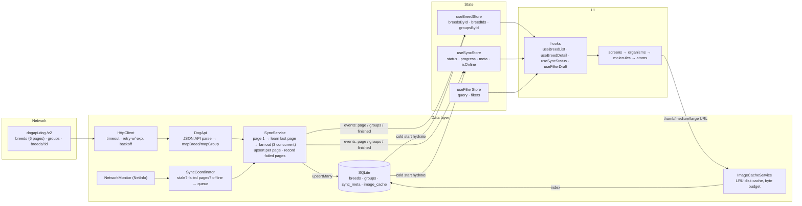

# Architecture

Dog Breed Explorer is an offline-first Expo (SDK 57) app. The source of truth on
device is SQLite; the network is treated as a background enrichment channel that
may or may not be available. The UI never waits on the network after the first
successful sync.

## Layers

```
app/                     expo-router routes — thin, one component each
src/screens/             compose hooks + organisms; no business logic
src/components/          atomic design
  atoms/                 AppText, Chip, IconButton, ScaleBar, StatusDot, …
  molecules/             BreedRow, SearchField, SyncStatusStrip, OfflineBanner, …
  organisms/             BreedList (FlashList), DetailHero, TraitsTab, FiltersForm, ErrorBoundary
  templates/             Screen
src/hooks/               logic layer: useBreedList, useBreedDetail, useFilterDraft, useSyncStatus, …
src/store/               Zustand stores (normalised breeds/groups, sync state, filters)
src/domain/              pure types + derivations + filter predicates (no React, no IO)
src/data/
  api/                   HttpClient (retry/backoff) → DogApi → mappers (DTO → domain)
  db/                    SQLite schema/migrations + repositories
  sync/                  SyncService (how), SyncCoordinator (when), NetworkMonitor
  images/                ImageCacheService — size-bounded LRU disk cache
src/services/            composition root (createServices) + React provider
src/theme/               design tokens (light/dark) + ThemeProvider
```

**UI and logic are separated by hooks.** Components receive plain props and
callbacks; every screen gets its data from a hook (`useBreedList`,
`useBreedDetail`, `useFilterDraft`, `useSyncStatus`). Hooks read Zustand stores
and call services; they never render. This keeps components trivially
testable (see `src/__tests__/components.test.tsx`) and lets the logic be unit
tested without React (`sync.SyncService.test.ts`, `domain.filters.test.ts`).

**SOLID in practice**

- *Single responsibility*: `HttpClient` only knows HTTP + retries; `DogApi` only
  knows endpoints and parsing; `SyncService` only knows how to assemble pages;
  `SyncCoordinator` only decides *when* to sync; `ImageCacheService` only manages
  disk budget.
- *Open/closed*: filters are pure predicates (`matchesFilters`) — adding a facet
  means adding a field and a clause, no UI or store rewrite.
- *Liskov*: every repository / service is an interface (`BreedRepository`,
  `DogApi`, `NetworkMonitor`, `ImageCacheService`); tests substitute fakes.
- *Interface segregation*: hooks depend on the narrow interface they use
  (`useSyncActions` only sees `coordinator` + `sync`).
- *Dependency inversion*: `createServices()` is the single composition root.
  Nothing under `src/hooks` or `src/components` imports `expo-sqlite`,
  `fetch` or `NetInfo` directly.

## Data flow



### Cold start (`useAppBootstrap`)

1. Open SQLite, run migrations (`PRAGMA user_version`).
2. Read all breeds, groups and sync meta → `useBreedStore.hydrate()`. This is
   a single local read; the list renders from it immediately.
3. Hide the splash screen. Fonts load in parallel.
4. Off the critical path: hydrate the image cache index, probe the network,
   and ask the coordinator to `syncIfNeeded` (stale > 60 min or never synced
   → full sync; only some pages failed → retry just those).

### Sync (`SyncService.syncAll`)

- Groups are fetched independently and never block breed pages.
- Page 1 is fetched first because `meta.pagination.last` tells us how many
  pages exist. The remaining pages are fetched with bounded concurrency (3).
- **Each page is upserted in its own transaction the moment it lands** and a
  `page` event carries it into the store, so cached rows stay on screen and
  new/updated rows merge in progressively ("Syncing page 3 of 6 · 50%").
- A failed page is recorded, not fatal. `sync_meta.failedPages` drives the
  partial-failure card; `retryFailedPages()` refetches only those pages.
- Concurrent `syncAll` calls are coalesced into the in-flight promise.

### Offline

- `NetworkMonitor` wraps NetInfo. The coordinator subscribes: on reconnect it
  runs any queued manual sync, otherwise a staleness check.
- Pull-to-refresh / "Sync now" while offline **queues** a sync (the status line
  shows "Sync queued for reconnect") instead of failing.
- The offline banner is persistent, not a toast. Search and filters keep
  working against the SQLite-backed store.

## SQLite schema

Hybrid design: indexed columns for the fields filters use + the full domain
object as a JSON payload.

```sql
breeds (
  id TEXT PK, name, group_id, size_band, coat_length, hypoallergenic INTEGER,
  good_with_children, good_with_dogs, good_with_strangers INTEGER,
  search_text TEXT, payload TEXT /* JSON Breed */, page_number, updated_at
)  -- idx on group_id, name
groups (id PK, name, label, breed_ids JSON, updated_at)
sync_meta (key PK, value JSON)   -- lastSyncedAt, lastAttemptAt, totalPages, failedPages[], totalRecords
image_cache (url PK, local_uri, variant, bytes, last_access)  -- idx on last_access
```

Why: the 283 rows are always read as a whole set and each row is deep (traits,
coat, origin, up to 10 images × 3 variants + attribution). Normalising into
`breed_images`, `breed_traits`, `breed_other_names`… would mean 5–6 joins to
rebuild one row for no query we actually run. The projected columns exist so
filtering could be pushed into SQL if the dataset grew by an order of
magnitude; today filtering 283 in-memory objects is ~1 ms.

## Image caching policy

Each breed ships up to 10 images × {thumb, medium, large}. Downloading all of
them would be ~283 × 10 × 3 requests and hundreds of MB, so:

| Where | Variant | When |
| --- | --- | --- |
| List row | `thumb` (1st image) | On render, via `useCachedImage` (renders remote URL immediately, swaps to local file when written) |
| Detail hero carousel | `medium` | Visible slide + neighbours (FlatList `windowSize: 3`) as the user swipes |
| Gallery carousel | `large` | Visible slide + neighbours as the user swipes / taps arrows or thumbs |
| Gallery strip | `thumb` (all images) | Prefetched when the gallery tab mounts |

`ImageCacheService` keeps an in-memory index (hydrated from `image_cache`) so
lookups are synchronous. Total bytes are tracked; when a write pushes the
total over `EXPO_PUBLIC_IMAGE_CACHE_LIMIT_MB` (default 60 MB) the
least-recently-accessed files are deleted (LRU, `selectEvictions`). Rows whose
file was purged by the OS are dropped at hydrate time.

## Navigation

expo-router with typed routes (`experiments.typedRoutes`):

- `/` — breed list
- `/filters` — modal
- `/breed/[id]?tab=overview|traits|gallery` — the tab is a URL param so deep
  links and back navigation restore it.

## Error handling

`ErrorBoundary` (class component) wraps the list, the detail content and the
filters form independently, plus one around the whole navigator. A crash
inside the gallery degrades to an inline "Try again" card; the rest of the
screen keeps working.
